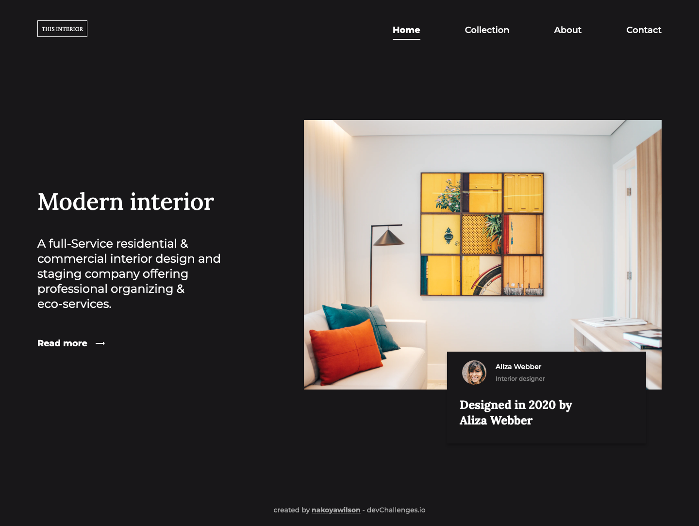

<!-- Please update value in the {}  -->

<h1 align="center">devChallenges - Interior Consultant</h1>

   Solution for a challenge from  <a href="http://devchallenges.io" target="_blank">Devchallenges.io</a>.

  <h3>
    <a href="https://nakoyawilson.github.io/devChallenges-interior-consultant/">
      Demo
    </a>
     | 
    <a href="https://devchallenges.io/solutions/fytL0Z07Du6n5JKUkrDL">
      Solution
    </a>
     | 
    <a href="https://devchallenges.io/challenges/Jymh2b2FyebRTUljkNcb">
      Challenge
    </a>
  </h3>

<!-- TABLE OF CONTENTS -->

## Table of Contents

- [Overview](#overview)
  - [Built With](#built-with)
- [Features](#features)
- [Useful Links](#useful-links)
- [Contact](#contact)

<!-- OVERVIEW -->

## Overview

### Built With

- HTML
- CSS
- JavaScript

## Features

This application/site was created as a submission to a [DevChallenges](https://devchallenges.io/challenges) challenge. The [challenge](https://devchallenges.io/challenges/Jymh2b2FyebRTUljkNcb) was to build an application to complete the given user stories.

## Useful Links

- [Responsive Homepage - Collab.](https://devchallenges.io/learn/tutorial/responsive-homepage) - This tutorial was helpful in creating the mobile navigation menu.

## Contact

- Website: [Nakoya Wilson](https://nakoyawilson.netlify.app/)
- GitHub: [@nakoyawilson](https://github.com/nakoyawilson)
- Twitter: [@nakoyawilson](https://twitter.com/nakoyawilson)
